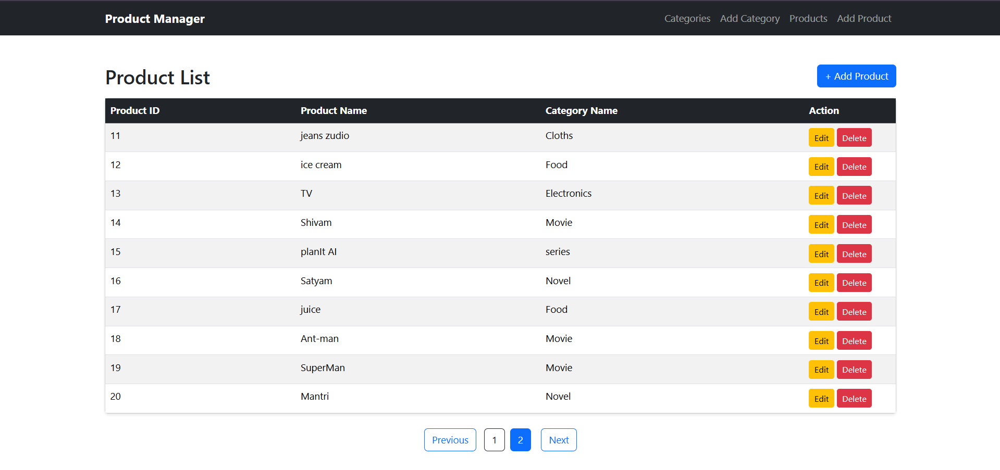
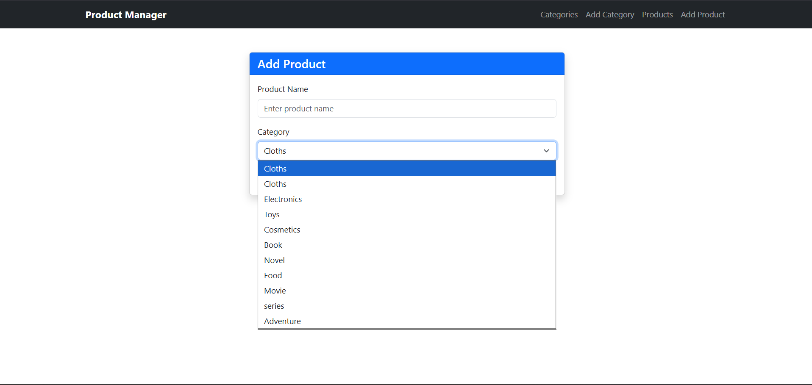
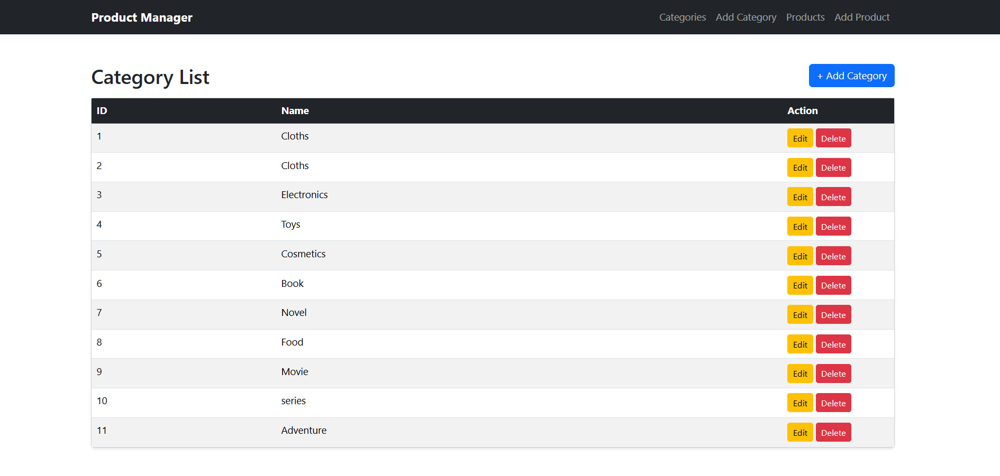
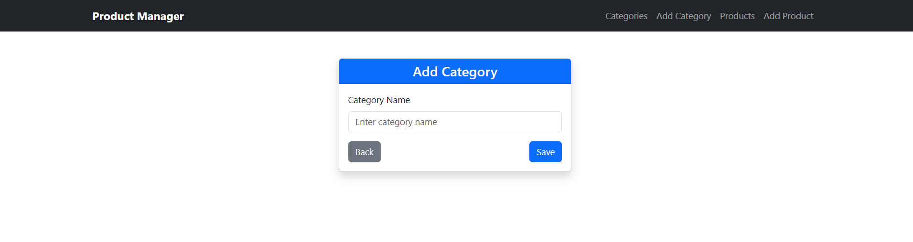
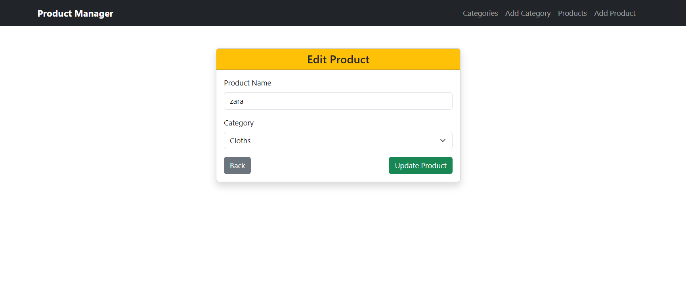

# Product Manager (Node.js + MySQL MVC)

A simple **Product and Category Management System** built using **Node.js, Express, MySQL, and EJS** following the **MVC architecture**.

The application allows users to manage categories and products where **each product belongs to a category**. It also implements **server-side pagination** for the product list.

---

## Features

### Category Management
- Add Category
- View Categories
- Edit Category
- Delete Category

### Product Management
- Add Product
- View Products
- Edit Product
- Delete Product
- Product belongs to a category

### Pagination
- Server-side pagination for products
- Displays limited records per page
- Uses `LIMIT` and `OFFSET`

---

## Tech Stack

- Node.js
- Express.js
- MySQL
- EJS (View Engine)
- Bootstrap
- MVC Architecture

---

## Installation

### 1. Clone the repository

git clone 

### 2. Install dependencies

npm install

### 3. Configure MySQL

Create database:

CREATE DATABASE product;

Create tables for **category** and **product**.

### 4. Run the server

node app.js

Server will run on:

http://localhost:3000

---

## Screenshots

---

## Pagination

The product list uses **server-side pagination**:

- Page size = 10
- Uses `LIMIT` and `OFFSET`

Example SQL:

LIMIT 10 OFFSET 20

